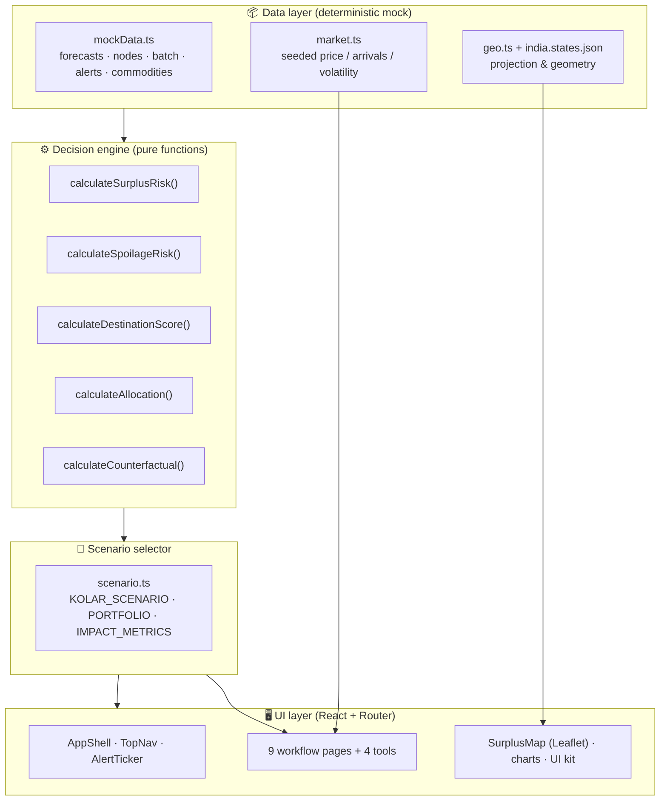
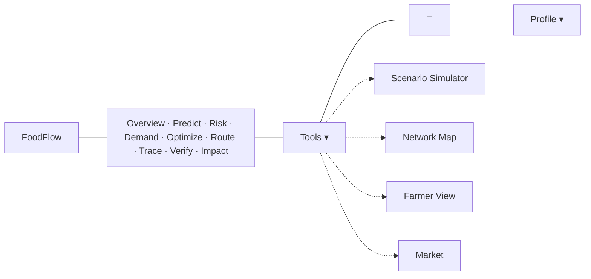
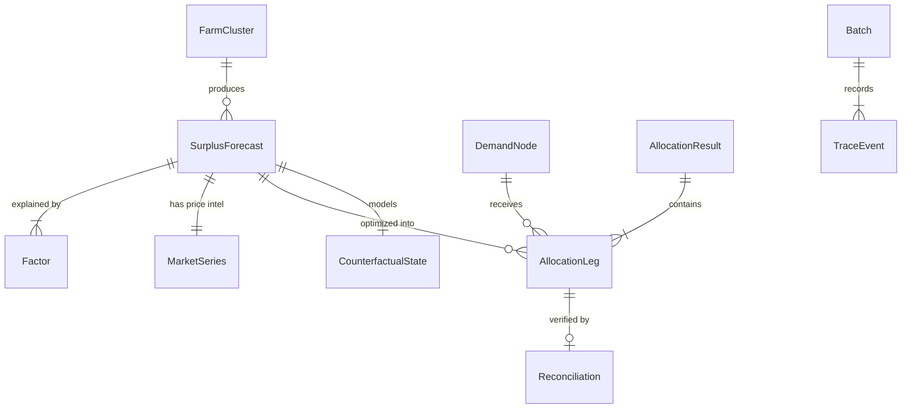

<div align="center">

# 🌾 FoodFlow

### Predict Surplus. Prevent Waste. Route Food Where It's Needed.

**A predictive food-allocation platform for agricultural surplus.**
FoodFlow forecasts *where* agricultural surplus will occur, scores its urgency and
perishability, and optimizes *where it should go* — before the usable window closes.

<br/>


</div>

---

## ✨ The one-line thesis

> **Mandi intelligence tells us what is *likely to happen* to the crop.**
> **FoodFlow decides what *should happen* to the food.**
> **Traceability + reconciliation prove what *actually happened* afterward.**

Existing systems are **reactive** — they ask *"where can today's surplus go?"* only
once food is already surplus and value is eroding. FoodFlow adds a **predictive
pre-surplus intervention layer** and **multi-destination allocation optimization**:

> *"Where will surplus occur next, how much is at risk, and where should it go
> before it becomes waste?"*

---

## 🔄 How it works — at a glance

```text
        🌦  MANDI  +  WEATHER  +  DEMAND   (Agmarknet-style signals)
                            │
                            ▼
   ┌─────────────────────────────────────────────────────────────────────┐
   │   01        02         03         04         05       06       07      08 │
   │ PREDICT → ASSESS  →  DEMAND  → OPTIMIZE →  ROUTE  → TRACE → VERIFY → IMPACT │
   │ surplus   risk &     who       multi-      is it    chain   did it   what   │
   │ ahead     window     needs it  destination moving?  of      arrive?  changed│
   │           of time              allocation          custody                  │
   └─────────────────────────────────────────────────────────────────────┘
      │                                                                    │
   predict the surplus ───────────────────────────────▶ prove the impact
```

> **Mandi intelligence → what's *likely* to happen · FoodFlow → what *should* happen · Traceability → what *actually* happened.**

---

## 🖥 Screenshots

<table>
  <tr>
    <td width="50%"><p align="center"><sub><b>00 · Overview</b> — network at a glance</sub></p></td>
    <td width="50%"><p align="center"><sub><b>01 · Predict</b> — surplus forecast board</sub></p></td>
  </tr>
  <tr>
    <td><p align="center"><sub><b>04 · Optimize</b> — multi-destination allocation</sub></p></td>
    <td><p align="center"><sub><b>Network Map</b> — real India tiles</sub></p></td>
  </tr>
  <tr>
    <td><p align="center"><sub><b>08 · Impact</b> — counterfactual & outcomes</sub></p></td>
    <td><p align="center"><sub><b>Scenario Simulator</b> — live what-if</sub></p></td>
  </tr>
  <tr>
    <td><p align="center"><sub><b>Market</b> — all-commodity price board</sub></p></td>
    <td><p align="center"><sub><b>Landing</b> — product site</sub></p></td>
  </tr>
  <tr>
    <td colspan="2"><p align="center"><sub><b>Event detail</b> — <b>live</b> Open-Meteo weather (honest provenance) beside clearly-labeled demo market intelligence</sub></p></td>
  </tr>
</table>

---

## 📑 Table of contents

- [Screenshots](#-screenshots)
- [What's inside](#-whats-inside)
- [System architecture](#-system-architecture)
- [The FoodFlow pipeline](#-the-foodflow-pipeline)
- [Application map & UI/UX](#-application-map--uiux)
- [Data model](#-data-model)
- [The decision engine](#-the-decision-engine)
- [Canonical scenario](#-canonical-scenario-kolar-tomato)
- [Tech stack](#-tech-stack)
- [Project structure](#-project-structure)
- [Routes](#-routes)
- [Getting started](#-getting-started)
- [Map configuration (API key)](#-map-configuration-api-key)
- [Deployment](#-deployment-vercel)
- [What's simulated vs. production](#-whats-simulated-vs-production)
- [Roadmap](#-roadmap)
- [Credits & attribution](#-credits--attribution)

---

## 🧩 What's inside

FoodFlow is a complete, working product prototype — not a landing page — built around
a single connected workflow and four supporting tools.

| Layer | Capability |
|---|---|
| **Market intelligence** | Agmarknet-style modal price history, ML-style price forecast with confidence band, mandi arrivals, **volatility scoring**, **anomaly detection**, nearby-market comparison, seasonality. |
| **Prediction** | Future **surplus** from supply-vs-demand imbalance, **spoilage / usable-window risk**, explainable risk factors (SHAP-style contributions). |
| **Decision** | **Sell / Hold / Redirect** logic, **destination rescue-priority scoring**, **multi-destination allocation optimization**. |
| **Execution** | Route/operations tracking, live shipment legs & corridors. |
| **Trust** | **QR batch identity**, tamper-evident supply-chain event ledger, **delivery verification** (allocated vs dispatched vs received). |
| **Impact** | Counterfactual (with vs. without FoodFlow), food preserved, farmer value protected, meals, emissions avoided. |
| **Signals** | Live predictive **alert ticker** + notification feed ("Onion ↑ ~12% · Nashik · 48h"). |

---

## 🏛 System architecture

FoodFlow is a client-side React SPA with a clean, layered architecture. Every screen
reads from a **single computed scenario selector**, so no two views can disagree.



**Design principle — one source of truth.** `scenario.ts` composes the engine over the
mock data once; the Command Overview, Optimization, Counterfactual and Impact screens
all consume the same computed object. Change a model weight in one place and every
screen updates consistently.

---

## 🔄 The FoodFlow pipeline

The product is one continuous system, not a collection of dashboards:

```mermaid
flowchart LR
    A["🌦 Mandi + weather<br/>+ demand"] --> B["📈 Price / supply<br/>forecast"]
    B --> C["🌾 Surplus<br/>prediction"]
    C --> D["⏳ Spoilage<br/>risk"]
    D --> E["🗺 Demand<br/>map"]
    E --> F["🎯 FoodFlow<br/>optimization"]
    F --> G["🚚 Routing"]
    G --> H["🔗 QR /<br/>traceability"]
    H --> I["✅ Delivery<br/>verification"]
    I --> J["📊 Impact"]

    style C fill:#e8f0e9,stroke:#1b5e3f
    style F fill:#e8f0e9,stroke:#1b5e3f
    style J fill:#e8f0e9,stroke:#1b5e3f
```



Each stage maps to a page the user can walk through end to end.

---

## 🖼 Application map & UI/UX

### Navigation

A single sticky **top navigation** (no sidebar). The nine workflow stages sit in the
centre as clean label pills with the current stage highlighted; the four secondary
tools live under a compact **Tools** menu. A **predictive-alert ticker** runs under the
header, and a **notification bell** holds the full signal feed.



### Screens — each answers one question

| # | Screen | Route | Answers… |
|---|--------|-------|----------|
| 00 | **Overview** | `/dashboard` | What's happening across the network? |
| 01 | **Predict** | `/predict` | Where will surplus happen? |
| 02 | **Assess Risk** | `/risk` | How serious is it? |
| 03 | **Find Demand** | `/demand` | Who needs the food? |
| 04 | **Optimize** | `/optimize` | Where should it go? |
| 05 | **Route** | `/operations` | Is it moving? |
| 06 | **Trace** | `/trace` | Where has it been? |
| 07 | **Verify** | `/verify` | Did it arrive? |
| 08 | **Measure Impact** | `/impact` | What difference did we make? |
| — | Event detail | `/event/:id` | Full market intelligence + decision for one event |
| 🛠 | Scenario Simulator | `/simulator` | What-if sliders → live risk |
| 🛠 | Network Map | `/map` | Geographic surplus & demand |
| 🛠 | Farmer View | `/farmer` | A grower's mobile-first view |
| 🛠 | Market | `/marketplace` | Live commodity prices + buyers/orgs |

### Design system

- **Tokens** — all colour defined as CSS variables (`--c-brand`, `--c-risk`, …) mapped
  into Tailwind, so the palette is single-source and theme-ready.
- **Palette** — deep agricultural green, warm off-white canvas, charcoal ink, restrained
  amber for warnings, red reserved for genuine risk, blue for demand/capacity.
- **Typography** — Inter (UI) + IBM Plex Mono (figures), with tabular numbers everywhere
  numbers matter.
- **Motion** — Framer Motion used to communicate causality (allocation flow, count-ups,
  counterfactual transitions), never as decoration; respects `prefers-reduced-motion`.
- **Progressive disclosure** — rows and cards show *numbers + labels + status + actions*;
  long reasoning is hidden behind expand/“view details”.
- **Accessibility** — semantic HTML, keyboard navigation, visible focus rings, ARIA on
  controls, sufficient contrast.
- **Responsive** — designed for desktop (primary), tablet and 390 px mobile.

---

## 🗃 Data model



Core entities (`src/types`): `FarmCluster`, `SurplusForecast` (+ `Factor[]`),
`DemandNode`, `AllocationResult`/`AllocationLeg`, `Batch`/`TraceEvent`, `Recipient`,
`Commodity`, `Alert`, `ImpactMetric`, `CounterfactualState`.

All data is **deterministic** — no `Math.random()` at call time — so a given scenario
renders identically every run. Market series use a seeded PRNG keyed by forecast id.

---

## ⚙️ The decision engine

Pure, explainable, swappable functions in `src/lib/engine.ts`. Each is a transparent
stand-in for a production model.

**Destination rescue-priority score** — deliberately *not* price-maximizing:

```
score = 0.40·demandPull + 0.34·absorptionCertainty + 0.14·needWeight + 0.12·proximity
```

**Allocation** — greedy by suitability, capacity-bounded: fill the highest-scoring
destinations first, up to each one's absorbable capacity, until the surplus is cleared.

**Counterfactual** — redirected tonnage is discounted by each destination's absorption
certainty **and** in-transit/handling loss (`distanceKm / 1440`), yielding the
effectively-preserved volume vs. a do-nothing baseline.

Also: `calculateSurplusRisk`, `calculateSpoilageRisk`, `calculateFoodFlowScore`,
`calculateFarmerValue`, `calculateMealsEquivalent`, `calculatePotentialWasteAvoided`.

---

## 🍅 Canonical scenario (Kolar Tomato)

One scenario drives the whole demo, and the engine output is verified to match it exactly:

| | |
|---|---|
| Predicted surplus | **15.2 T** |
| Forecast horizon | **72 h** |
| Waste risk | **87 / 100** |
| Arrivals / demand | **+38% / −12%** · 32°C · 72h window |
| **Allocation** | Community **3.2T** · Bengaluru market **4.0T** · Mysuru processor **5.0T** · Kolar local **3.0T** |
| Destination scores | 95 · 92 · 81 · 73 → **optimization score 85** |
| **Redirected** | **13.4 T** in-window · residual **1.8 T** |
| **Preserved** | **6.9 T** · farmer value **₹1.66 L** · **17.3 K** meals · 17.9 tCO₂e avoided |

Scope: a pan-India network of **14 surplus events** across 11 states and **~32 commodities**.

---

## 🛠 Tech stack

| Concern | Choice |
|---|---|
| Framework | React 18 + TypeScript (strict) |
| Build | Vite 5 |
| Styling | Tailwind CSS 3 (+ CSS-variable design tokens) |
| Routing | React Router 6 (lazy-loaded routes, protected app shell) |
| Maps | Leaflet + react-leaflet (CARTO / OSM tiles; optional MapTiler key) |
| Charts | Recharts |
| Motion | Framer Motion |
| Icons | lucide-react |
| Auth & data | **Firebase Authentication** (email/password) + **Cloud Firestore** (user profiles, operational updates) with locked-down security rules |

---

## 📁 Project structure

```
FoodFlow/
├── public/                 # favicon, _redirects, robots.txt
├── src/
│   ├── components/
│   │   ├── layout/         # TopNav, AppShell, AlertTicker, NotificationBell
│   │   ├── map/            # SurplusMap (Leaflet)
│   │   ├── flow/           # FoodFlow signature diagram
│   │   └── ui/             # Card, Badge, Button, StatTile, Meter, Img …
│   ├── data/               # mockData, scenario (selector), market, geo, workflow, images
│   ├── features/           # one folder per screen
│   │   ├── overview/ predict(surplus-radar)/ risk/ need-map/ optimization/
│   │   ├── operations/ traceability/ recipient(verify)/ impact/ event-detail/
│   │   ├── simulator/ network-map/ farmer/ marketplace/
│   │   ├── landing/        # public marketing site
│   │   └── auth/           # login / signup
│   ├── hooks/              # useCountUp
│   ├── lib/                # engine, auth, format, cn
│   ├── types/              # domain model
│   ├── App.tsx             # routes
│   └── main.tsx
├── vercel.json             # SPA rewrites + asset caching
├── .env.example            # VITE_MAPTILER_KEY
└── tailwind.config.js
```

---

## 🧭 Routes

**Public:** `/` (landing) · `/login` · `/signup`
**Workflow (auth-gated):** `/dashboard` `/predict` `/risk` `/demand` `/optimize`
`/operations` `/trace` `/verify` `/impact` · `/event/:id`
**Tools:** `/simulator` `/map` `/farmer` `/marketplace`

Old paths redirect automatically (`/command → /dashboard`, etc.).

---

## 🚀 Getting started

**Prerequisites:** Node.js 18+ and npm.

```bash
# install
npm install

# run the dev server (http://localhost:5173)
npm run dev

# type-check + production build
npm run build

# preview the production build
npm run preview
```

> **Sign-in uses Firebase Authentication** (email/password). Without Firebase
> env vars the login screen explains what to configure (see below); with them,
> accounts are real and profiles + operational updates persist in Firestore.

---

## 🔐 Firebase setup (auth + Firestore)

FoodFlow uses **Firebase Authentication** (email/password) and **Cloud
Firestore** for user profiles and operational updates (delivery/shipment status
on the Verify and Route screens persist to each user's private account).

1. In the [Firebase console](https://console.firebase.google.com) create a
   project and add a **Web app**.
2. **Authentication → Sign-in method →** enable **Email/Password**.
3. **Firestore Database → Create database** (production mode).
4. Publish the included security rules in [`firestore.rules`](firestore.rules)
   (console **Firestore → Rules**, or `firebase deploy --only firestore:rules`).
   They are locked down: a user can read/write **only their own** document and
   `operationalData` subcollection, with field + value validation.
5. Copy the Web app config into a local `.env` (see [`.env.example`](.env.example)):
   ```
   VITE_FIREBASE_API_KEY=...
   VITE_FIREBASE_AUTH_DOMAIN=...
   VITE_FIREBASE_PROJECT_ID=...
   VITE_FIREBASE_STORAGE_BUCKET=...
   VITE_FIREBASE_MESSAGING_SENDER_ID=...
   VITE_FIREBASE_APP_ID=...
   ```

> These `VITE_` values are **client-side** config — public by design once bundled
> into any Firebase web app. Security comes from the Firestore **rules** above and
> enabling Auth, not from hiding the config. Never put service-account keys here.

---

## 🗺 Map configuration (API key)

The map shows **India** by default and works **with no API key** using free
[CARTO Positron](https://carto.com/basemaps/) tiles (OpenStreetMap data).

To use a sharper, higher-rate-limit keyed provider:

1. Create a **free** account at **[cloud.maptiler.com](https://cloud.maptiler.com)**.
2. Go to **Account → API keys** and copy your key.
3. Create a `.env` file (copy from `.env.example`) and set:
   ```
   VITE_MAPTILER_KEY=your_key_here
   ```
4. Restart `npm run dev`. The map auto-switches to MapTiler.

> Alternatives you can drop in the same way: **Mapbox** (`api.mapbox.com`) or
> **Stadia Maps**. Only the tile URL in `src/components/map/SurplusMap.tsx` changes.

---

## ☁️ Deployment (Vercel)

The repo ships with `vercel.json` (SPA rewrites + immutable asset caching) and a
Netlify `public/_redirects`, so client-side routing and deep links work on refresh.

**Auto-deploy (recommended):** import the GitHub repo into Vercel once → framework
is auto-detected as **Vite** (build `npm run build`, output `dist`). Add the
environment variables below under **Settings → Environment Variables**. After that,
**every push to `main` deploys automatically** (and every PR gets a preview URL) —
no CLI needed.

**Environment variables to set in Vercel** (Production + Preview):

| Variable | Required | Purpose |
|---|---|---|
| `VITE_FIREBASE_API_KEY` | yes (for auth) | Firebase web config |
| `VITE_FIREBASE_AUTH_DOMAIN` | yes | Firebase web config |
| `VITE_FIREBASE_PROJECT_ID` | yes | Firebase web config |
| `VITE_FIREBASE_STORAGE_BUCKET` | yes | Firebase web config |
| `VITE_FIREBASE_MESSAGING_SENDER_ID` | yes | Firebase web config |
| `VITE_FIREBASE_APP_ID` | yes | Firebase web config |
| `VITE_MAPTILER_KEY` | optional | sharper keyed map tiles |

> After deploying, add your Vercel domain under Firebase **Authentication →
> Settings → Authorized domains** so sign-in works in production.

**Vercel (CLI):**
```bash
npm i -g vercel
vercel          # preview
vercel --prod   # production
```

`vercel.json`:
```json
{
  "rewrites": [{ "source": "/(.*)", "destination": "/index.html" }]
}
```

---

## 🔌 Real data, models & tests

FoodFlow is being moved from prototype toward a real data-backed system. What is
**genuinely integrated and tested** (full ledger in [`DATA.md`](DATA.md)):

| Area | Status | How to reproduce |
|---|---|---|
| **Weather** (Open-Meteo) | ✅ **Live, tested** — real current + forecast for all 14 mandis; shown with a `Live` badge, source and freshness, with honest demo fallback | `npm run ingest:weather` |
| **Market** (Agmarknet / data.gov.in) | ⚠️ live connector built & unit-tested, but `api.data.gov.in` **isn't reachable in this build** — no data fabricated, status recorded | `npm run ingest:market` (needs key + egress) |
| **Price-forecast model** | ✅ **trained on real data** — 7-day-ahead mandi modal-price forecaster on `master_aggriculture_dataset.csv` (654k market-days, 1,377 markets, 5 commodities, 2023–25); chronological held-out test; beats naive persistence by **~10% RMSE** and seasonal climatology by **~73% RMSE**. Metrics shown live on **Impact** | `npm run ml:train:price` → [`ml/`](ml/README.md) |
| **ML pipeline (weather)** | ✅ **real & reproducible** — chronological split, baselines vs GradientBoosting, honest MAE/RMSE on real Open-Meteo history | `npm run ml:train` → [`ml/`](ml/README.md) |
| **Real market prices** | ✅ **real dataset prices in the UI** — per-market modal prices sliced from `master_aggriculture_dataset.csv` (Tomato, Onion, Potato, Rice, Wheat). In **Live data** mode the Market board and each commodity's **price-by-place** view show these real numbers; Demo mode shows the illustrative board | `npm run ml:export:prices` → `public/data/market-prices.json` |
| **Per-commodity optimizer** | ✅ the Optimize page rebuilds a full scenario for the **selected** surplus event — destinations priced to that crop — so allocation, greedy baseline and realized ₹ differ per commodity (no longer always tomato) | `src/data/destinations.ts`, `npm run test` |
| **Allocation optimizer** | ✅ real marginal-value optimizer (concave objective, capacity + conservation constraints), compared to greedy baseline | `npm run test` |
| **Provenance** | ✅ UI distinguishes **Live / Historical / Model / Estimate / Demo**; never labels fallback as Live | `src/lib/provenance.ts` |
| **Live / Demo toggle** | ✅ a top-bar switch flips the whole app between **Demo** (illustrative scenario only, the default) and **Live data**, which activates every real source: the ingested weather snapshot, the trained model's held-out metrics, and real dataset market prices. Simulated and real numbers never mix; the choice persists per browser | `src/lib/dataMode.tsx` |

```bash
npm run test            # 32 tests: normalization, optimizer constraints, engine + per-crop invariants
npm run ingest:weather  # real Open-Meteo snapshot → public/data/weather.json
npm run ml:train:price  # real price model → ml/artifacts/price_metrics.json + public/data/model-metrics.json
npm run ml:export:prices # real per-market prices → public/data/market-prices.json
```

> **Honesty notes.** A real **price-forecast model is now trained** on
> `master_aggriculture_dataset.csv`; its metrics on the **Impact** page are the
> model's own held-out test numbers (never fabricated), and we report where
> naive persistence still wins (typical-day MAE) rather than cherry-pick. These
> real numbers — the model metrics, the live weather feed, and the real
> per-market dataset prices in the Market board and each commodity's
> price-by-place view — load only when the top-bar **Live data** toggle is on.
> Demo mode stays purely illustrative so the two never blur. The
> live Agmarknet *ingestion* panel stays labeled **Demo** until the API is
> reachable with a key. Surplus risk is a **transparent heuristic**, not a
> trained model and **not** verified food waste. The traceability ledger is
> deterministic/in-memory and is **never** described as a blockchain transaction.
> See [`DATA.md`](DATA.md) for the complete provenance and limitations.

---

## 🔬 What's simulated vs. production

This is a **prototype / sandbox**. It demonstrates *how the real system would work*.

| Simulated here | Becomes in production |
|---|---|
| Deterministic mock forecasts & prices | Live Agmarknet feed + trained demand/price models |
| `calculateSurplusRisk / Spoilage` | Perishability + weather ML models |
| `calculateAllocation` (greedy) | LP / min-cost-flow solver with transport constraints |
| Tamper-evident hashes (string) | Permissioned ledger (e.g. Hyperledger Fabric) |
| ~~localStorage auth~~ → **Firebase Auth + Firestore** (done) | + role-based authorization |
| Reconciliation numbers | IoT / weighbridge-verified receipts |

The price-forecast model **is** trained on real data (metrics on the Impact
page are its own held-out test results); the in-app scenario figures and the
traceability ledger remain illustrative, and no blockchain transaction occurred.

---

## 🛣 Roadmap

- [x] Real weather integration (Open-Meteo) with provenance + fallback
- [x] Real optimizer (marginal-value / concave objective) + constraint tests
- [x] Reproducible ML pipeline with honest metrics
- [x] Train the price model on real mandi history (7-day-ahead, metrics live on Impact)
- [x] Real dataset prices in the Market board + price-by-place view (Live mode)
- [x] Per-event optimization for every commodity (not just the canonical scenario)
- [x] Firebase Authentication (email/password) + Firestore persistence with locked-down rules
- [ ] Reach `api.data.gov.in` + key → live Agmarknet prices (connector ready)
- [ ] Wire the trained model to score live forecasts in-app (currently reports held-out metrics)
- [ ] Backend for scheduled ingestion, persistence & secure credentials
- [ ] Real persistence + QR deep-link verification for batches
- [ ] Farmer SMS / IVR channel · Dark mode

---

## 🙏 Credits & attribution

- **Map geometry** — [GADM](https://gadm.org/) via
  [geohacker/india](https://github.com/geohacker/india), simplified.
- **Map tiles** — [CARTO](https://carto.com/) basemaps · © OpenStreetMap contributors.
- **Photography** — [Unsplash](https://unsplash.com) (CC).
- **Concept inspiration** — market-intelligence patterns from MandiBhav &
  AgriPrice-Intelligence; QR/supply-chain event model from ChainFair. FoodFlow's
  contribution is the predictive pre-surplus + multi-destination optimization layer.

---

## 📄 License

MIT © **skypank-coder**

<div align="center">
<br/>
<strong>FoodFlow</strong> — predict the surplus before it happens,<br/>
route the food before it loses value, and prove the impact afterward.
</div>
